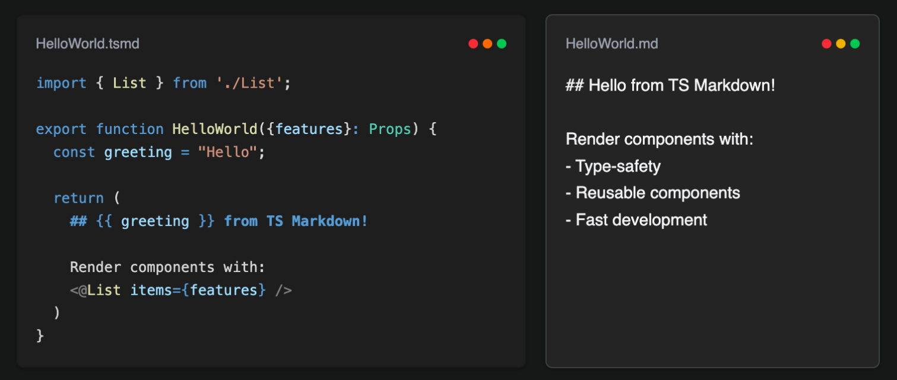

# TS Markdown



A TS Markdown (TSMD) framework that allows embedding markdown content within TypeScript functions using special block expressions. Create dynamic, template-driven content with full TypeScript support.

> ⚠️ **Early Alpha**: This library is in early alpha and is not stable for production applications.

## ✨ Features

- **⚡ TypeScript Integration** - Full TypeScript support with type checking and IntelliSense
- **🎯 Template Interpolation** - Dynamic content with `{{ expression }}` syntax
- **🔀 Conditional Rendering** - Smart conditional blocks with ternary operators and logical AND
- **🛠️ Developer Tools** - Comprehensive CLI, VS Code extension, and testing utilities
- **📊 Performance Optimized** - Built-in caching and optimization features
- **🧪 Testing Framework** - Complete testing utilities with snapshot testing

## 🚀 Quick Start

### Installation

```bash
npm install tsmarkdown
# or
bun add tsmarkdown
```

### Create Your First TSMD File

```ts
// Welcome.tsmd

function Welcome() {
  const appName = 'My App';
  const version = '1.0.0';
  const isProduction = false;

  return (
    # Welcome to {{ appName }}! 🎉

    Current version: **{{ version }}**

    {{ isProduction ? (
      ## Production Mode ✅
      Your app is running in production mode.
    ) : (
      ## Development Mode 🚧
      You're in development mode with hot reload enabled.
    ) }}
  )
}
```

### Basic Usage

```typescript
import { parseTSMD, compileTSMD, executeTSMDTemplate } from 'ts-markdown';

// Parse TSMD content
const parsed = parseTSMD(tsmdContent);

// Compile to intermediate format
const compiled = compileTSMD(parsed);

// Execute with context
const result = executeTSMDTemplate(compiled, {
  // Component context
});

console.log(result.content); // Final rendered markdown content
```

## 📖 Documentation

### Core Concepts

#### 1. Template Interpolation

Use `{{ expression }}` to embed dynamic content:

```ts
function UserProfile() {
  const user = { name: 'Alice', age: 30, skills: ['React', 'TypeScript'] };

  return (
    # {{ user.name }}'s Profile

    **Age:** {{ user.age }}

    **Skills:** {{ user.skills.join(', ') }}

    **Bio:** {{ user.age > 25 ? 'Experienced developer' : 'Junior developer' }}
  )
}
```

#### 2. Conditional Rendering

Create dynamic content with conditional blocks:

```ts
function Dashboard() {
  const { user, isLoggedIn } = useAuth();
  const notifications = getNotifications();

  return (
    # Dashboard

    {{ isLoggedIn && (
      Welcome back, {{ user.name }}!
    ) }}

    {{ !isLoggedIn && (
      Please [log in](./login) to continue.
    ) }}

    {{ notifications.length > 0 && (
      ## Notifications ({{ notifications.length }})
      {{ notifications.map(n => `- ${n.message}`).join('\n') }}
    ) }}

    {{ notifications.length === 0 && (
      No new notifications.
    ) }}
  )
}
```

#### 3. Component Integration

Use components with the `<@ComponentName/>` syntax:

```ts
import { FeatureDetailView } from './components';

function Homepage() {
  const features = ['Fast', 'Type-safe', 'Developer-friendly'];

  return (
    # Welcome to TS Markdown

    Get started in minutes with our powerful framework.

    ## Features

    {{ features.map(feature => `<@FeatureDetailView feature="${feature}" />`).join('\n') }}
  )
}
```

### CLI Usage

#### Development Server

Start a development server with hot reload:

```bash
tsmarkdown dev
# or with custom port
tsmarkdown dev --port 8080
```

#### Building for Production

```bash
tsmarkdown build
# or with custom output directory
tsmarkdown build --output ./dist
```

#### Project Initialization

Create a new TS Markdown project:

```bash
tsmarkdown init my-project
cd my-project
bun install
tsmarkdown dev
```

#### File Operations

```bash
# Compile a single file
tsmarkdown compile my-file.tsmd

# Execute with mock context
tsmarkdown execute my-file.tsmd

# Watch files for changes
tsmarkdown watch ./tsmd
```

### Testing

TS Markdown includes comprehensive testing utilities:

```typescript
import { TSMDTestRunner, createTSMDTest, createTSMDTestSuite } from 'ts-markdown/testing';

const runner = new TSMDTestRunner();

// Create individual tests
const test = createTSMDTest('Basic interpolation', `
function Test() {
  const greeting = 'Hello';
  return (
    # {{ greeting }} World!
  )
}
`)
.expectContent('# Hello World!')
.build();

// Run test
const result = await runner.runTestCase(test);

// Create test suites
const suite = createTSMDTestSuite('Core Features')
  .addTest(test)
  .addTest(/* more tests */)
  .build();

await runner.runTestSuite(suite);
```

#### Test CLI

```bash
# Run all tests
tsmarkdown-test run

# Watch tests
tsmarkdown-test watch

# Update snapshots
tsmarkdown-test snapshot update

# Validate TSMD files
tsmarkdown-test validate ./tsmd
```

### VS Code Extension

Install the TS Markdown VS Code extension for:

- **Syntax highlighting** for TSMD files
- **IntelliSense** for template expressions
- **Error detection** and diagnostics
- **Snippets** for common patterns
- **Live preview** of TSMD content

### Hot Module Replacement (HMR)

HMR is built into the development server and provides:

- **Live reload** when TSMD files change
- **Error overlay** for compilation errors
- **WebSocket connection** for real-time updates

## 🏗️ Architecture

TS Markdown follows a multi-phase compilation process:

### Phase 1: Parsing
- Extract imports, function declarations, and TypeScript code
- Separate Markdown content from TypeScript logic
- Generate Abstract Syntax Tree (AST)

### Phase 2: Compilation
- Process template interpolations (`{{ expression }}`)
- Handle conditional rendering blocks
- Create intermediate representation

### Phase 3: Execution
- Execute TypeScript code in safe environment
- Resolve template expressions with runtime context
- Generate final markdown content

### Phase 4: Rendering
- Convert to HTML or other output formats
- Optimize for performance

## 🔧 API Reference

### TSMDParser

```typescript
class TSMDParser {
  parse(content: string): ParsedTSMD;
}

interface ParsedTSMD {
  imports: string[];
  functionName: string;
  typescript: string;
  markdown: string;
  interpolations: Array<{ placeholder: string; expression: string }>;
  conditionalBlocks: Array<{ condition: string; content: string }>;
}
```

### compileTSMD

```typescript
function compileTSMD(parsed: ParsedTSMD): CompiledTSMD;

interface CompiledTSMD {
  id: string;
  template: string;
  dependencies: string[];
  metadata: {
    functionName: string;
    imports: string[];
    exports: string[];
    version: string;
  };
  interpolations: Array<{ placeholder: string; expression: string }>;
  conditionalBlocks: Array<{ condition: string; content: string }>;
}
```

### executeTSMDTemplate

```typescript
async function executeTSMDTemplate(
  compiled: CompiledTSMD, 
  context?: TemplateContext, 
  props?: any, 
  basePath?: string
): Promise<TemplateExecutionResult>;

interface TemplateExecutionResult {
  content: string;
  errors: string[];
}
```

### Client Renderer

```typescript
class ClientRenderer {
  render(compiled: CompiledTSMD, context?: Record<string, any>): RenderedResult;
}

interface RenderedResult {
  markdown: string;
  metadata: any;
  dependencies: string[];
  executionTime: number;
}
```

## 🎯 Examples

### Blog Post with Dynamic Content

```ts
import { formatDate, readingTime } from './utils';

function BlogPost() {
  const post = {
    title: 'Getting Started with TS Markdown',
    author: 'Jane Developer',
    publishDate: new Date('2024-01-15'),
    content: '...',
    tags: ['tsmd', 'typescript', 'markdown']
  };

  const estimatedReadingTime = readingTime(post.content);

  return (
    # {{ post.title }}

    **Author:** {{ post.author }}
    **Published:** {{ formatDate(post.publishDate) }}
    **Reading time:** {{ estimatedReadingTime }} minutes

    {{ post.content }}

    ## Tags
    {{ post.tags.map(tag => `[${tag}](#${tag})`).join(' • ') }}
  )
}
```

### Product Documentation

```ts
function ProductPage() {
  const product = getProduct();
  const reviews = getProductReviews(product.id);

  return (
    # {{ product.name }}

    **Price:** ${{ product.price }}
    **Rating:** {{ product.averageRating }}/5 ({{ reviews.length }} reviews)

    ## Description
    {{ product.description }}

    {{ product.inStock ? (
      ✅ **In Stock** - Available for purchase
    ) : (
      ❌ **Out of Stock** - Get notified when available
    ) }}

    ## Reviews ({{ reviews.length }})
    {{ reviews.slice(0, 5).map(review => `
    **${review.author}** - ${review.rating}/5
    > ${review.comment}
    `).join('\n') }}
  )
}
```

## 🤝 Contributing

We welcome contributions! Please see our [Contributing Guide](CONTRIBUTING.md) for details.

### Development Setup

```bash
git clone https://github.com/ts-markdown/ts-markdown
cd ts-markdown
bun install
bun run dev
```

### Running Tests

```bash
bun test
# or with coverage
bun test --coverage
```

## 📜 License

MIT © [TS Markdown Team](https://github.com/ts-markdown)

## 🔗 Links

- [Documentation](https://ts-markdown.dev)
- [Examples](https://github.com/ts-markdown/examples)
- [VS Code Extension](https://marketplace.visualstudio.com/items?itemName=ts-markdown.ts-markdown)
- [Discord Community](https://discord.gg/ts-markdown)

---

Made with ❤️ by the TS Markdown team